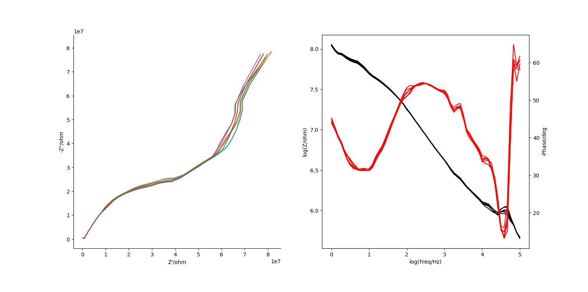

# 📈 EIS Plotter


**Visualize Electrochemical Impedance Spectroscopy (EIS) data** with Python.  
This tool parses `.txt` files from a **CH Instruments CHI650E** and produces clean **Nyquist** and **Bode plots** for analysis and publication.

---

## 🔍 Features

- 📂 Load `.txt` files from CHI650E output into `pandas.DataFrame`
- 📉 Generate:
  - Nyquist plots
  - Bode plots (2-panel or overlaid)
  - Combined Nyquist + Bode plots
  - Multi-file comparison plots
- ⚙️ Clean axis formatting, shared limits, and export-ready figures

---

## 🧪 Example Plot

 
---

## 📁 Input Format

This parser expects CHI `.txt` files with a line that starts:

```

Freq/Hz, Z'/ohm, Z"/ohm, Z/ohm, Phase/deg

````

All metadata before this line is captured and returned as a string. Columns are parsed automatically into numerical values.

---

## 🚀 Quick Start

```bash
git clone https://github.com/bschelske/EIS.git
cd eis-plotter
pip install -r requirements.txt
````


---

## 🛠 Functions

| Function                | Description                                   |
| ----------------------- | --------------------------------------------- |
| `get_file_paths(dir)`   | Returns list of `.txt` files in a directory   |
| `open_file_as_df(file)` | Returns `(DataFrame, metadata_str)`           |
| `nyquist_plot(df)`      | Returns Nyquist plot                          |
| `bode_plot(df)`         | Returns Bode plot (2 subplots)                |
| `bode_plot_overlay(df)` | Bode plot with phase + impedance on same axes |
| `nyquist_and_bode(df)`  | Combined Nyquist and Bode plot                |
| `compare_both(df_list)` | Overlay of multiple datasets (Nyquist + Bode) |

---

## 🧠 Why This Exists

This repo was developed during my graduate research. I needed a modern, reproducible, and scriptable alternative to proprietary EIS analysis software plotting.
